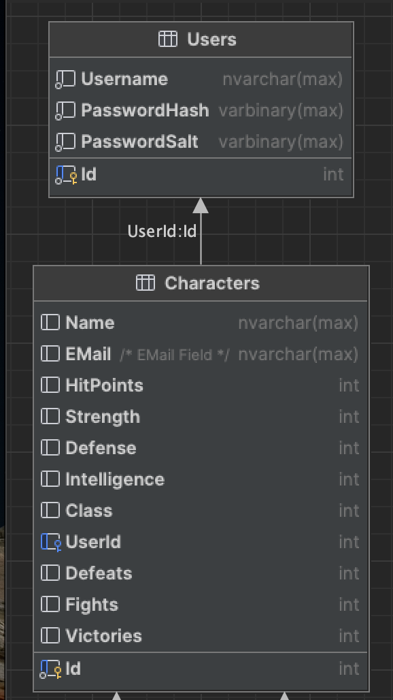

# JSON Web Token Authentication Exploration

## Description

The objective is to create a service that will serve to manage characters / users and add login/logout (auth)
functionality using JSONWeb Tokens with .NET 7,Exploring Web APIs, and the Entity Framework as the backend

## Updates

* Added initial Character / User Model + Enum, Character / User Class
* Added API calls to get list of Characters / Users, and get single Character / User (R in CRUD)
* Added remaining method calls to the service for Create (Insert), Update and Delete operations (CUD in CRUD)
* Added Core Entity Framework, Core Entity Framework Design, Core Entity Framework - MS SQL Server Support
* Added MS SQL (Mac, Docker) and Azure Data Studio (instead of SQL Server Management Studio)
* Added correct(!) connection string for MS SQL in Docker for Mac (TODO: add for windows)
* Added Data Context to map models to MS SQL Tables; setup migrations
* Added Login Functionality
* Added JSON Web Tokens for secure auth
* Added secured method testing for Swagger
* Added basic ID filter with JSON Auth to get claimed data
* Added MS SQl Server backup file to repository
* Exported Sample Postman Collection to repository
* Created Simple Web Pages to illustrate access to API

## TODOs

* update documentation
* code cleanup
* repo cleanup
  
## Requirements

* ASP.NET 7.x
* MS SQL Server Express or Developer Edition (currently using 2022)
* (Windows Only) SQL Server Management Studio
* (Mac Only) Docker Container to setup MS SQL Server
* (Mac Only) Azure Data Studio

## Schema

## Notes

Each feature that was built-out has its own branch and is functionally complete in each branch.
You can view the specific commits in the log for each branch to see the changes performed there.

## Nice-To-Haves

* add an intermediate node middleware to act as a bastion to API access
* refactor characters to employees
* Add CRUD functionality to manage characters
* Create seeders (instead of MS SQL backup)
